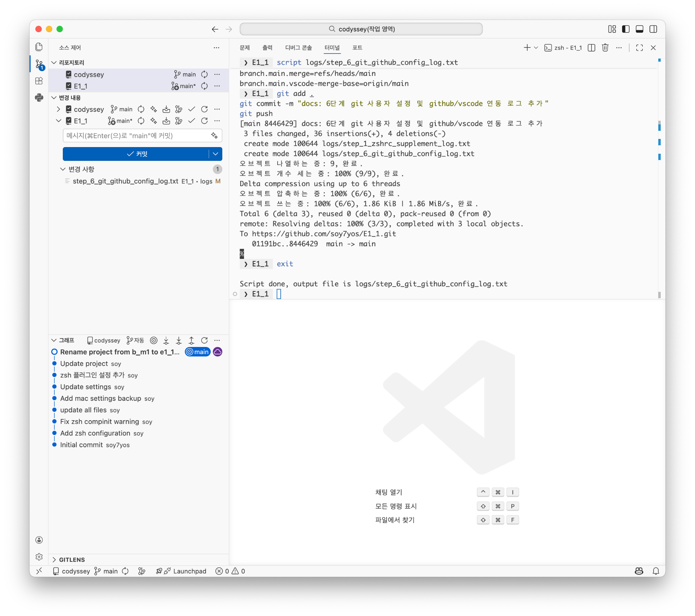
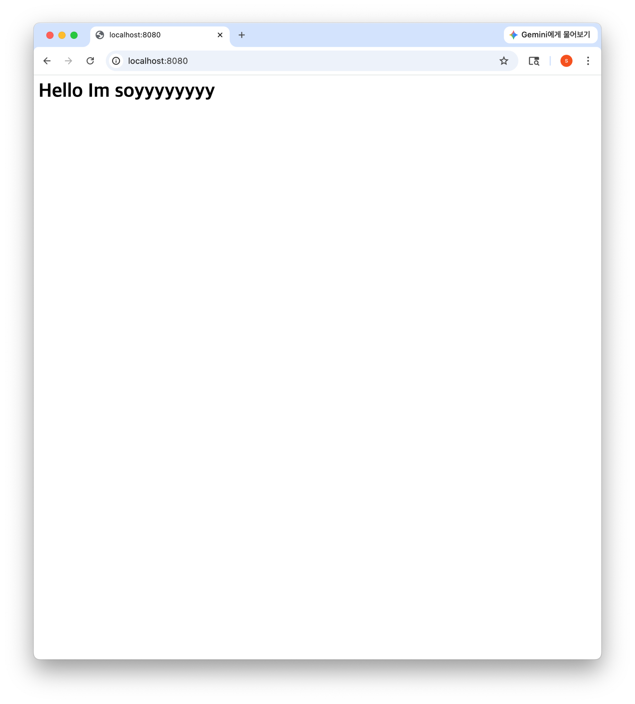

# 내 컴퓨터에 개발자용 '작업실' 꾸미기

## 1. 프로젝트 개요
터미널 · Docker · Git 세 가지 핵심 도구를 직접 손으로 세팅하며,
"내 컴퓨터에서만 돌아가는 문제"를 줄이고 재현 가능한 개발 워크스테이션을 구축하는 과제.
파일/디렉토리 조작 및 권한 실습 → Docker 설치/운영 → 커스텀 이미지 빌드/포트 매핑 →
바인드 마운트/볼륨 영속성 검증 → Git/GitHub 연동 순으로 진행.

## 2. 실행 환경
| 항목 | 내용 |
|---|---|
| OS | macOS (Apple Silicon, M1) |
| Shell / Terminal | zsh, VS Code 내장 터미널 |
| Container Runtime | OrbStack (사내 보안 정책상 `sudo` 제한 우회, Docker 엔진 내장 구동) |
| Docker | 28.5.2 (`docker --version` → `Docker version 28.5.2, build ecc6942`) |
| Git | 2.53.0 (`git --version` → `git version 2.53.0`) |

> 📌 **디렉토리/저장소명 변경 이력**: 6단계(Git/GitHub 연동) 진입 전 로컬 디렉토리명 및 GitHub 저장소명을 `b_m1` → `E1_1`으로 변경함. 1~5단계 로그의 터미널 프롬프트·경로에는 이전 이름(`b_m1`)이, 6단계 로그부터는 변경된 이름(`E1_1`)이 표시되나 동일 프로젝트의 연속 기록임.

## 3. 수행 체크리스트
- [x] 터미널 기본 조작 (생성/이동/복사/삭제/내용 확인)
- [x] 파일 권한 변경 (chmod 000/644)
- [x] 디렉토리 권한 변경 (chmod 700/755)
- [x] Docker 설치 및 데몬 점검 (`docker --version`, `docker info`)
- [x] Docker 기본 운영 (`images`, `ps -a`, `logs`, `stats`)
- [x] hello-world / ubuntu 컨테이너 실행 및 exec·attach 차이 검증
- [x] Dockerfile 기반 커스텀 이미지 빌드 (nginx:alpine 베이스)
- [x] 포트 매핑 및 접속 검증 (`-p 8080:80`, `curl`)
- [x] 바인드 마운트 양방향 반영 검증
- [x] 볼륨 영속성 검증 (컨테이너 삭제 후 데이터 유지)
- [x] Git 사용자 설정 및 GitHub/VSCode 연동
- [x] 보안 점검 (민감정보 마스킹) 및 README 최종 정리

## 4. 검증 방법
| 항목 | 명령어 | 결과 위치 |
|---|---|---|
| 터미널 기본 조작 | `pwd`, `ls -al`, `mkdir`, `cp`, `mv`, `rm` | [step_1_terminal_permission_log.txt](logs/step_1_terminal_permission_log.txt) |
| 파일 권한 변경 | `chmod 000/644 test.txt` | [step_1_terminal_permission_log.txt](logs/step_1_terminal_permission_log.txt) |
| 디렉토리 권한 변경 | `chmod 700/755 perm_test_dir` | [step_1_permission_supplement_log.txt](logs/step_1_permission_supplement_log.txt) |
| zsh 인라인 주석 설정 | `setopt interactivecomments` | [step_1_zshrc_supplement_log.txt](logs/step_1_zshrc_supplement_log.txt) |
| Docker 데몬 확인 | `docker info` | [step_2_docker_setup_log.txt](logs/step_2_docker_setup_log.txt) |
| Docker 버전 확인 | `docker --version`, `git --version` | [step_2_docker_version_supplement_log.txt](logs/step_2_docker_version_supplement_log.txt) |
| Docker 기본 운영 | `docker images/ps/logs/stats` | [step_3_docker_basic_ops_log.txt](logs/step_3_docker_basic_ops_log.txt) |
| 커스텀 이미지 빌드/실행 | `docker build`, `docker run -p` | [step_4_docker_custom_image_log.txt](logs/step_4_docker_custom_image_log.txt) |
| 포트 매핑 접속 | `curl http://localhost:8080` | [step_4_docker_custom_image_log.txt](logs/step_4_docker_custom_image_log.txt) |
| 바인드 마운트 | `docker run -v $(pwd)/...:/data`, `docker exec` | [step_5_bind_mount_volume_log.txt](logs/step_5_bind_mount_volume_log.txt) |
| 볼륨 영속성 | `docker volume create`, `docker rm -f` 전/후 비교 | [step_5_bind_mount_volume_log.txt](logs/step_5_bind_mount_volume_log.txt) |
| Git 설정/연동 | `git config --list`, `git remote -v` | [step_6_git_github_config_log.txt](logs/step_6_git_github_config_log.txt) |
| 포트 매핑 브라우저 접속 화면 | 주소창(`localhost:8080`) + 응답 화면 캡처 | [port_mapping_curl.png](docs/screenshots/port_mapping_curl.png) |
| VSCode GitHub 연동 화면 | 브랜치명/동기화 아이콘 캡처 | [vscode_github_sync.png](docs/screenshots/vscode_github_sync.png) |

## 5. 수행 로그 (발췌)

### 5-1. 권한 실습
```
$ chmod 000 test.txt
$ cat test.txt
cat: test.txt: Permission denied
$ chmod 644 test.txt
$ cat test.txt
hello

$ chmod 700 perm_test_dir
$ ls -ld perm_test_dir
drwx------  2 user  user  64  8  2 14:46 perm_test_dir
$ chmod 755 perm_test_dir
$ ls -ld perm_test_dir
drwxr-xr-x  2 user  user  64  8  2 14:46 perm_test_dir
```

### 5-2. Docker 기본 점검/운영
```
$ docker --version
Docker version 28.5.2, build ecc6942

$ docker run hello-world
Hello from Docker!
This message shows that your installation appears to be working correctly.

$ docker run -it --name my_ubuntu ubuntu bash
root@...:/# ls
bin boot dev etc home lib ...
root@...:/# echo hello
hello

$ docker run -d --name my_nginx -p 8080:80 nginx
$ docker stats --no-stream
CONTAINER ID   NAME       CPU %     MEM USAGE / LIMIT     ...
8f897f642089   my_nginx   0.00%     6.387MiB / 15.67GiB   ...
```

**exec vs attach 관찰**: `docker exec -it <name> bash` 후 `exit`은 새로 생성된 셸 프로세스만 종료되어 컨테이너는 계속 실행됨. 반면 `docker attach <name>` 상태에서 `exit`은 PID 1(메인 프로세스)을 직접 종료시켜 컨테이너 자체가 정지됨.

### 5-3. 커스텀 이미지 빌드 및 포트 매핑
```
$ docker build -t my_web:1.0 .
...
=> => naming to docker.io/library/my_web:1.0

$ docker run -d -p 8080:80 --name my_custom_web my_web:1.0
$ docker ps
CONTAINER ID   IMAGE        ...   PORTS                     NAMES
eb0573108cd5   my_web:1.0   ...   0.0.0.0:8080->80/tcp      my_custom_web

$ curl http://localhost:8080
<h1>Hello Im soyyyyyyyy</h1>
```

### 5-4. 바인드 마운트 / 볼륨 영속성
```
$ echo "host original content" > bind_mount_test/data.txt
$ docker run -d --name bind_test -v $(pwd)/bind_mount_test:/data ubuntu sleep infinity
$ docker exec bind_test cat /data/data.txt
host original content

$ docker exec bind_test bash -c 'echo "modified from container" >> /data/data.txt'
$ cat bind_mount_test/data.txt
host original content
modified from container

$ docker volume create mission_data
$ docker run -d --name vol_test1 -v mission_data:/data ubuntu sleep infinity
$ docker exec vol_test1 bash -c 'echo "persistent hello" > /data/hello.txt'
$ docker rm -f vol_test1
$ docker run -d --name vol_test2 -v mission_data:/data ubuntu sleep infinity
$ docker exec vol_test2 cat /data/hello.txt
persistent hello
```

### 5-5. Git 설정/연동
```
$ git config --global user.name
**
$ git config --global user.email
****os@gmail.com
$ git branch --show-current
main
$ git remote -v
origin  https://github.com/****os/E1_1.git (fetch)
origin  https://github.com/****os/E1_1.git (push)
$ git push
Everything up-to-date
```

**VSCode GitHub 연동 화면**


## 6. Dockerfile 기반 커스텀 이미지
**선택 베이스**: `nginx:alpine` (방식 A — 웹 서버 베이스 + 정적 콘텐츠/설정 교체)

```dockerfile
FROM nginx:alpine
LABEL org.opencontainers.image.title="myweb"
ENV APP_ENV=dev
COPY index.html /usr/share/nginx/html/index.html
```

| 커스텀 포인트 | 목적 |
|---|---|
| `LABEL org.opencontainers.image.title` | 이미지 메타데이터로 용도 식별 |
| `ENV APP_ENV=dev` | 코드 변경 없이 환경 구분 가능하도록 설정값 분리 |
| `COPY index.html ...` | 기본 nginx 웰컴 페이지 대신 자체 정적 콘텐츠 서빙 |

빌드/실행: `docker build -t my_web:1.0 .` → `docker run -d -p 8080:80 --name my_custom_web my_web:1.0`
소스: `app/Dockerfile`, `app/index.html`

**포트 매핑 접속 화면**


## 7. 트러블슈팅

### 7-1. `docker build` 시 데몬 연결 실패
- 문제: `docker build -t my_web:1.0 .` 실행 시 "Cannot connect to the Docker daemon" 에러
- 원인 가설: OrbStack 데몬이 완전히 기동되기 전에 명령 실행
- 확인: `docker info`로 데몬 상태 재확인 → 정상 응답
- 해결: 잠시 후 `docker build` 재실행 → 정상 빌드 성공
- (출처: [step_4_docker_custom_image_log.txt](logs/step_4_docker_custom_image_log.txt))

### 7-2. 디렉토리 권한 변경(chmod 700) 결과 캡처 실패
- 문제: 여러 줄 명령을 한 번에 붙여넣는 과정에서 `# 주석` 뒤 괄호(`확인(700`)가 zsh 글롭 한정자로 오인되어 `ls -ld` 명령 파싱 실패, `zsh: unknown file attribute: 7` 에러 발생 → 700 상태 출력 미확보
- 원인 가설: 인터랙티브 zsh는 기본적으로 `#` 인라인 주석을 지원하지 않아 붙여넣기 시 공백 소실과 맞물려 취약
- 확인: 로그상 에러 위치와 700 상태 `ls -ld` 출력 부재 대조
- 해결: 1차로 명령을 주석 없이 한 줄씩 재실행하여 700 상태(`drwx------`) 캡처 완료. 재발 방지를 위해 `~/.zshrc`에 `setopt interactivecomments` 추가 후 반영 확인
- (출처: [step_1_permission_supplement_log.txt](logs/step_1_permission_supplement_log.txt), [step_1_zshrc_supplement_log.txt](logs/step_1_zshrc_supplement_log.txt))

## 8. 재현 방법
1. OrbStack(또는 Docker Desktop) 설치 및 실행
2. 저장소 클론 후 `app/` 디렉토리에서 `docker build -t my_web:1.0 .`
3. `docker run -d -p 8080:80 --name my_custom_web my_web:1.0`
4. 브라우저 또는 `curl http://localhost:8080`으로 접속 확인
5. 볼륨 영속성: `docker volume create <name>` → 컨테이너 연결/데이터 기록 → `docker rm -f` → 재생성 컨테이너에서 데이터 확인

> 개인 PC 종속 경로(`~/b_m1`, `$(pwd)/bind_mount_test` 등)는 임의 작업 디렉토리로 대체 가능. 포트(`8080`) 충돌 시 호스트 포트만 변경.

## 9. 보안 및 개인정보 보호
- 모든 로그의 사용자명/이메일/저장소 소유자명은 마스킹 처리 완료
- SSH 키, 토큰, 비밀번호 등 인증 정보는 어떤 로그에도 포함되지 않음
